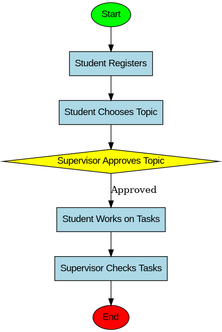

# Дигитализация на дипломни работи

## Описание

Този проект е платформа за дигитализация на процеса по създаване и управление на дипломни работи в ТУЕС. Платформата осигурява лесен и ефективен начин за учениците да избират теми, да се свързват с ръководители, да получават обратна връзка и да следят задачите и сроковете си.

## Основни функции

1. Избор на тема
2. Избор на дипломен ръководител
3. Различни видове рангове на потребителите
4. Управление на задачи и срокове
5. Регистрация и вход в системата

## Технологии и инфраструктура

- Backend: Python и Flask за създаване на API и управление на сървърната логика.
- Frontend: HTML, CSS и JavaScript за създаване на потребителския интерфейс.
- База данни: SQL база данни за съхранение на информацията за потребителите, темите, задачите и коментарите.
- Допълнителни инструменти: Интеграция с календари за управление на задачите, система за известия и напомняния.

  

